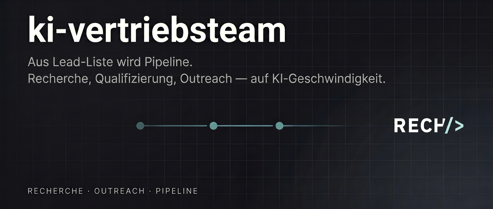

<p align="center">
  <a href="https://rech.studio">
    
  </a>
</p>

<p align="center">
  <a href="#installation"></a>
  <a href="#15-skills"></a>
  <a href="#5-agents"></a>
  <a href="LICENSE"></a>
  <a href="https://rech.studio"></a>
</p>

# ki-vertriebsteam — Sales-Plugin für Claude Code

> **Skills und Agents für einen KI-augmentierten B2B-Vertriebsalltag.**
> Default-Sprache: **Deutsch**. Antwortet automatisch in der Sprache deiner Eingabe.
> Plugin-Version: **v1.0.0** · Veröffentlicht via **rech-studio-Marketplace**.

`ki-vertriebsteam` bündelt 15 Sales-Skills und 5 parallele Research-Agents in einem Claude-Code-Plugin. Vertriebler bekommen damit out-of-the-box:

- **Lead-Triage in 60 Sekunden** + **Volltiefen-Prospect-Analyse** mit 5 parallelen Subagenten
- **Deterministisches BANT/MEDDIC-Scoring** (numerischer Backbone via `lead_scorer.py` + LLM-Qualitätsbewertung)
- **Buying-Committee-Mapping** mit Seniority/Department/Buying-Role-Klassifikation (`contact_finder.py`)
- **Cold-/Warm-/Referral-Email-Sequenzen**, **Meeting-Briefings**, **Angebote**, **Einwandbehandlung**
- **Pipeline-Reports** (Markdown + PDF)
- **Customizable Templates** — User editiert Vorlagen, Edits überleben Plugin-Updates

---

## Installation

In zwei Slash-Commands:

```bash
/plugin marketplace add jonasrech/rech-studio-plugins
/plugin install ki-vertriebsteam@rech-studio
```

Kein `git clone`, kein bash-Skript. Für die Installation reicht ein laufendes Claude Code (CLI, VS Code Extension, JetBrains Plugin oder Cowork Desktop).

### Voraussetzungen

- Claude Code in beliebigem Host
- **Python 3** auf dem System (für Pre-Pass-Scripts und PDF-Generierung)
- **`reportlab`** Python-Library (für PDF-Reports): `pip install reportlab`

Ohne Python laufen alle Skills, die Python-gestützten Pfade (deterministisches Scoring + PDF) fallen auf reine LLM-Pfade zurück.

---

## 15 Skills

Alle Skills folgen dem Schema `/ki-vertriebsteam:<skill-name>`. Default-Output ist Deutsch (Default-Sprache, spiegelt User-Input).

### Prospect-Analyse & Recherche

| Skill | Beschreibung | Output |
|---|---|---|
| `sales` | Help-Menu + Smart-Router (Natursprache → passender Sub-Skill mit Confirmation) | Terminal |
| `sales-quick <url>` | 60-Sekunden-Triage (1 WebFetch, kein Subagent) — Top 3 Chancen + Top 3 Bedenken | Terminal-Scorecard |
| `sales-prospect <url>` | Volltiefen-Analyse mit 5 parallelen Subagenten + Aggregation | `PROSPECT-ANALYSIS.md` |
| `sales-research <url>` | Firmographics + Wachstumssignale über 8 Dimensionen | `COMPANY-RESEARCH.md` |
| `sales-qualify <url>` | BANT + MEDDIC-Scoring (deterministisch via `lead_scorer.py` + LLM-Qualität) | `LEAD-QUALIFICATION.md` |
| `sales-contacts <url>` | Decision-Maker-Mapping mit Seniority/Department/Buying-Role-Klassifikation (`contact_finder.py`) | `DECISION-MAKERS.md` |
| `sales-competitors <url>` | Battle-Cards für aktuell genutzte Vendor-Stack des Prospects | `COMPETITIVE-INTEL.md` |

### Outreach & Follow-up

| Skill | Beschreibung | Output |
|---|---|---|
| `sales-outreach <prospect>` | Cold/Warm/Referral-Email-Sequenzen (5/3/3 Emails über 21/14/14 Tage) | `OUTREACH-SEQUENCE.md` |
| `sales-followup <prospect>` | Multi-Touch Follow-up nach Meeting / Demo / Proposal | `FOLLOWUP-SEQUENCE.md` |
| `sales-objections <topic>` | Einwand-Behandlungs-Playbook (LAER-Framework, 15 Universal + Industry-Specific) | `OBJECTION-PLAYBOOK.md` |

### Verkaufs-Assets

| Skill | Beschreibung | Output |
|---|---|---|
| `sales-prep <url>` | Meeting-Briefing (Cheat Sheet, Discovery Questions, Talking Points) | `MEETING-PREP.md` |
| `sales-proposal <client>` | 11-Section-Angebotsdokument mit ROI-Anchoring | `CLIENT-PROPOSAL.md` |
| `sales-icp <description>` | Ideal-Customer-Profile-Builder (6 Dimensionen) | `IDEAL-CUSTOMER-PROFILE.md` |

### Pipeline & Reporting

| Skill | Beschreibung | Output |
|---|---|---|
| `sales-report` | Pipeline-Report aus allen vorhandenen Analysen (Markdown) | `SALES-REPORT.md` |
| `sales-report-pdf` | Pipeline-Report als PDF (Cover, Charts, Action Plan, Methodologie) | `SALES-REPORT-{date}.pdf` |

---

## 5 Agents

Werden automatisch von `sales-prospect` als parallele Subagenten via `Task` tool gestartet — nicht direkt aufgerufen:

| Agent | Verantwortlich für | Score-Gewicht |
|---|---|---|
| `sales-company` | Firmographics, Financial Signals, Growth Trajectory, Tech Stack | 25 % |
| `sales-contacts` | Buying-Committee, Org-Chart, Personalisations-Anker | 20 % |
| `sales-opportunity` | BANT/MEDDIC-Assessment, Pain Points, Budget Signals | 20 % |
| `sales-competitive` | Current Vendors, Switching Costs, Competitive Gaps | 15 % |
| `sales-strategy` | Outreach-Strategie, Channel-Auswahl, First-Email-Draft | 20 % |

Aggregierter Composite Score 0–100 mit Grade A+/A/B/C/D.

---

## Sprachverhalten

**Default Deutsch.** Das Plugin antwortet immer in der Sprache deiner letzten Eingabe — wenn unklar oder leer, fällt es auf Deutsch zurück.

```
User: "schreib mir cold email für example.com"
→ Plugin antwortet auf Deutsch, Output-Datei (`OUTREACH-SEQUENCE.md`) auf Deutsch.

User: "write me a cold email for example.com"
→ Plugin antwortet auf Englisch, Output-Datei auf Englisch.
```

**Output-Dateinamen bleiben Englisch** (`PROSPECT-ANALYSIS.md`, `MEETING-PREP.md`, ...) — maschinenfreundliche Konvention. Nur **Inhalt** der Dateien wechselt mit der Eingabesprache.

Die Sprachregel ist deterministisch: byte-identisches Inline-Block in jedem Skill und Agent, kein Reliance auf Hooks (die in manchen IDE-Hosts droppen).

---

## Updates & Versionierung

Plugin-Versionen werden via git-Tags verwaltet. Du entscheidest, wann du updatest:

```bash
# Marketplace auf neuesten Stand bringen
/plugin marketplace update rech-studio

# Plugin auf neue Version aktualisieren
/plugin update ki-vertriebsteam
```

**Versions-Pinning:** Eine bestimmte Version (z.B. `v1.0.0`) ist reproduzierbar installierbar — der Marketplace pinnt jeweils einen git-Tag.

**Plugin-Cache-Hinweis:** Nach `/plugin marketplace update` brauchst du gelegentlich `/plugin install ki-vertriebsteam@rech-studio` erneut, damit der Cache die neue Version lädt. Bekanntes Verhalten von Claude Code, kein Plugin-Bug.

---

## Customizing Templates

Vier Skills laden Output-Templates zur Laufzeit. Du kannst diese Templates anpassen — z.B. um deine eigene Tonalität, Corporate-Voice, Standard-Formulierungen oder Branding-Boilerplate einzubauen.

**Override-Pfad** (User-Customization, überlebt Plugin-Updates):

```
~/.claude/ki-vertriebsteam/templates/<filename>.md
```

Verfügbare Templates:

| Datei | Verwendet von | Zweck |
|---|---|---|
| `meeting-prep.md` | `sales-prep` | Meeting-Briefing-Struktur (Cheat Sheet, Attendee Profiles, Discovery Questions) |
| `objection-playbook.md` | `sales-objections` | Einwand-Behandlungs-Spielbuch (LAER-Framework) |
| `outreach-cold.md` | `sales-outreach` | 5-Email Cold-Sequenz über 21 Tage |
| `outreach-warm.md` | `sales-outreach` | 3-Email Warm-Sequenz |
| `outreach-referral.md` | `sales-outreach` | 3-Email Referral-Sequenz |
| `proposal-template.md` | `sales-proposal` | 11-Section Angebotsdokument |

**So geht's:**

```bash
# Override-Verzeichnis anlegen
mkdir -p ~/.claude/ki-vertriebsteam/templates

# Plugin-Template als Startpunkt kopieren (Pfad gilt für v1.0.0)
cp ~/.claude/plugins/cache/rech-studio/ki-vertriebsteam/v1.0.0/skills/sales-prep/templates/meeting-prep.md \
   ~/.claude/ki-vertriebsteam/templates/meeting-prep.md

# Editieren — eigene Tonalität, Sektionen, [PLACEHOLDER]-Felder
$EDITOR ~/.claude/ki-vertriebsteam/templates/meeting-prep.md
```

Beim nächsten Skill-Aufruf wird automatisch deine Override-Version genutzt statt der Plugin-Vorlage.

**Wichtige Eigenschaften:**

- Override-Dateien überleben Plugin-Updates — der Plugin-Cache wird ersetzt, dein Custom-Pfad bleibt unberührt.
- Wenn du einen Override löschst oder umbenennst, fällt der Skill automatisch auf das Plugin-Template zurück.
- `[PLACEHOLDER]`-Tokens werden vom LLM mit prospect-spezifischen Inhalten gefüllt — Tokens kannst du beliebig hinzufügen oder entfernen.

---

## Trust-Modell

**Nach der Installation laufen Plugin-Komponenten mit derselben Berechtigung wie der Claude-Code-Prozess. Es gibt keine Sandbox.**

Konkret heißt das:
- Skills können WebFetch, WebSearch, Bash-Befehle ausführen
- Python-Scripts (`analyze_prospect.py`, `contact_finder.py`, `lead_scorer.py`, `generate_pdf_report.py`) werden im User-Kontext ausgeführt
- Kein Per-Permission-Prompt nach der initialen Plugin-Installation

User, die `ki-vertriebsteam@rech-studio` installieren, vertrauen rech.studio auf dem Niveau einer **VS-Code-Extension**. Wer den Code prüfen will: alles ist Open Source unter MIT, einsehbar im Plugin-Repo.

Quellcode der Scripts: [`scripts/`](scripts/) im Plugin-Repo.

---

## Maintainer & Beitragen

- **Repo:** [github.com/jonasrech/ki-vertriebsteam-claude](https://github.com/jonasrech/ki-vertriebsteam-claude)
- **Marketplace:** [github.com/jonasrech/rech-studio-plugins](https://github.com/jonasrech/rech-studio-plugins)
- **Maintainer:** Jonas Rech · [rech.studio](https://rech.studio) · jonas@rech.studio
- **Lizenz:** [MIT](LICENSE)

Future-Plugins von rech.studio (Marketing, Research, ...) erscheinen im selben Marketplace — keine zweite `add`-Aktion nötig.

### Smoke-Test vor Release (Maintainer)

```bash
./tools/smoke-test.sh
```

Prüft 13 strukturelle Checks (Manifest-Validität, Frontmatter, Sprachregel-Identität, Pfad-Konvertierung, Template-Verkabelung, Script-Wiring) vor jedem Tag.

Lokales Testen ohne Marketplace-Roundtrip:

```bash
claude --plugin-dir "$(pwd)"
# dann in der Claude-Session:
/ki-vertriebsteam:sales
```

---

<p align="center">
  Built by <a href="https://rech.studio">rech.studio</a> for B2B sales teams who deserve better tooling.
</p>
